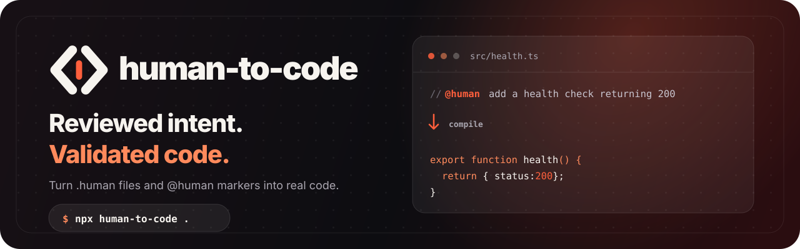
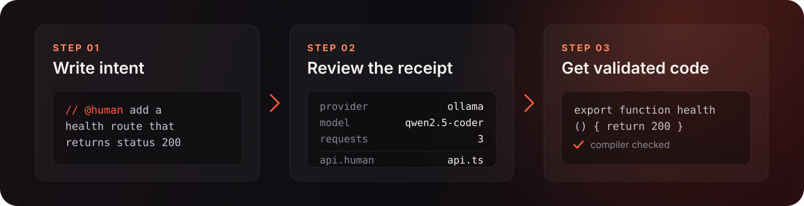
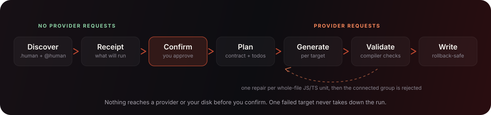
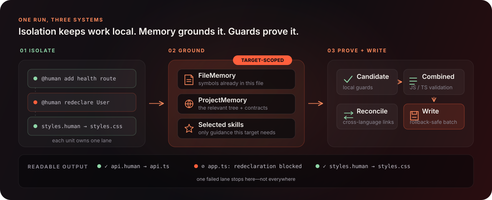
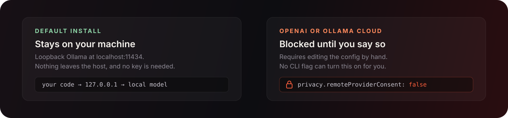

<!-- <p align="center">
  
</p> -->

<p align="center">
  
</p>

<p align="center">
  
</p>

<p align="center">
  <a href="https://www.npmjs.com/package/human-to-code"></a>
  <a href="#release-status"></a>
  <a href="https://github.com/Sharjeelbaig/Human-To-Code/actions/workflows/ci.yml"></a>
  <a href="#development-checks"></a>
  <a href="LICENSE"></a>
  <a href="CONTRIBUTING.md"></a>
</p>

<p align="center">
  
</p>

<p align="center">
  <a href="#quick-start">&nbsp;Quick start</a>
  &nbsp;·&nbsp;
  <a href="#how-it-works">&nbsp;How it works</a>
  &nbsp;·&nbsp;
  <a href="#cli">&nbsp;CLI</a>
  &nbsp;·&nbsp;
  <a href="#configuration">&nbsp;Configuration</a>
  &nbsp;·&nbsp;
  <a href="docs/CONFIGURATION.md">&nbsp;Config reference</a>
  &nbsp;·&nbsp;
  <a href="CONTRIBUTING.md">&nbsp;Contributing</a>
  &nbsp;·&nbsp;
  <a href="#community">&nbsp;Community</a>
</p>

You know the loop: you're in your IDE, you jump over to ChatGPT, paste some
context, copy the answer back, fix the indentation. Again.

human-to-code removes that loop. Write a comment saying what you want:

```ts
// @human add a function named health that returns { status: 200 }
```

Then run `npx human-to-code .`. The comment becomes the code, right there in
your file.

Starting from scratch? Don't open a `.ts` or a `.py`. Write a `file.human`
instead, one plain-English line at a time, and it compiles to real TypeScript,
JavaScript, Python, Rust, HTML, or CSS. Pseudocode that actually runs.

Either way you keep your grip on the codebase. You're not handing the whole
thing to an agent and hoping it comes back with something you recognize.

## How it works

<p align="center">
  
</p>

You say what you want. The tool shows you what it plans to do and stops. After
you confirm, it generates each target, checks the result against the rest of
your project, and only then writes.

### What you get

<table>
<tr>
<td width="50%" valign="top">

**Your codebase, not a blank slate**

ProjectMemory hands each request your real file tree, the planned outputs, and
compact contracts for related files. Generated code imports what exists instead
of inventing a module.

</td>
<td width="50%" valign="top">

**Validated before it is written**

TypeScript and opted-in JavaScript go through the TypeScript compiler against
your unchanged baseline. Other languages get deterministic structural checks.
Inline edits are diffed, so errors that were already there are never blamed on
the new code.

</td>
</tr>
<tr>
<td width="50%" valign="top">

**Local-first and private by default**

A fresh install talks to loopback Ollama. Remote providers stay blocked until
you set `privacy.remoteProviderConsent` yourself. Credentials live in
environment variables, and the config only ever names them.

</td>
<td width="50%" valign="top">

**No surprise requests**

The receipt shows the planned request count before you confirm, with
classification, shared contract, todo, and coding passes counted separately and
conditional repair ceilings listed on top.

</td>
</tr>
<tr>
<td width="50%" valign="top">

**Cross-file coherence**

A shared contract settles names once per run. Static reference checks then catch
a stylesheet selector no markup matches, or a handler nothing calls, without
spending another request.

</td>
<td width="50%" valign="top">

**Guarded writes**

Whole-file output lands as one rollback-protected batch. Inline replacements
check exact bytes first, so a file that changed under you is skipped rather than
clobbered.

</td>
</tr>
</table>

## Quick start

```bash
npx human-to-code .
```

The `.` is the folder to scan, not permission to rewrite it. A default run:

1. **Scans** for `.human` files and inline `@human` markers. It never imports
   your application modules and never executes your project config.
2. **Warns** about marker-shaped requests in file types it can't handle, and
   refuses a `.human` request whose output file already exists. Ignored
   directories and symlinks stay out of discovery.
3. **Prints a receipt**: the languages this worklist selected, the provider, the
   model, the request count, and every source-to-output path.
4. **Waits.** Nothing is written until you confirm or pass `-y`. If it found no
   requests you get `NEEDS_INPUT`.
5. **Converts, validates, writes.** [Generation engine](#generation-engine)
   covers what happens inside that step.

You don't need a configured provider to scan and preview. A default run picks
loopback Ollama with `qwen2.5-coder:7b`, so a fresh `npx human-to-code .` sends
nothing anywhere. That model does have to be installed already, because the tool
will never pull one for you.

To use a different local model, OpenAI, or Ollama Cloud, write a config first:

```bash
npx human-to-code --init .
```

`--init` won't overwrite a config you already have. Remote generation always
needs a config file, because `privacy.remoteProviderConsent` starts at `false`
and no CLI flag can flip it.

Converting an inline marker in place:

```bash
printf '// @human add a function named health that returns { status: 200 }\n' > health.ts
npx human-to-code . --yes --model qwen2.5-coder:7b
# health.ts now has the function where the marker used to be.
```

From a source checkout:

```bash
npm ci
npm run build
node dist/cli.js .
```

Node.js 24 or newer is required.

## Generation engine

<p align="center">
  
</p>

The host stays in control and the model only proposes code or requests bounded
read-only evidence. Each inline marker gets a small classification request,
then edit turns use a strict generated-code schema. Whole `.human` files go
straight to coding. On loopback Ollama the model may call `request_context`
before answering; tool use is optional, so a model can still finish without a
tool call.

### What it picks up

Inline discovery covers `.ts`, `.tsx`, `.mts`, `.cts`, `.js`, `.jsx`, `.mjs`,
`.cjs`, `.html`, `.htm`, `.css`, `.py`, `.rs`, `.go`, `.java`, `.rb`, `.cs`,
`.cpp`, `.cc`, `.c`, `.h`, and `.hpp`. A marker-shaped request in any other
regular file under 1 MiB gets reported as unsupported rather than silently
skipped. Ignored directories, dot directories, and symlinks stay out of the walk,
and oversized unsupported files are never opened just to produce a notice.

The scanner is lexical. It reads `// @human` and `# @human` line comments,
single-line and multiline `/* @human ... */` blocks, decorated JSDoc comments,
and `<!-- @human ... -->` in HTML. Inside HTML it also reads the JavaScript and
CSS comment forms in `<script>` and `<style>`. Anything marker-shaped sitting in
a quoted attribute, a string, a template literal, prose in a doc comment, or
another comment stays inert. When it does replace a marker, it removes exactly
the comment range it recognized and leaves the surrounding text, newline style,
and indentation alone.

Inline markers are ordered conversation turns. Before any code is generated, a
strict classifier decides whether each one asks for an edit or only adds context
(greetings and problem statements count as context). Context-only markers are
left unchanged, and earlier messages feed bounded session memory for later
markers in the same run.

### What holds it together

<p align="center">
  
</p>

- **Per-marker isolation.** Every `@human` marker is classified on its own. Edit
  turns are generated and applied independently, and context turns are kept for
  session memory. If one marker's output is bad, say a small model redeclares a
  symbol that already exists, that marker is retried and then skipped with a
  printed reason. The rest still convert.
- **FileMemory.** Declarations already in the file are given to the model as
  read-only context, so it reuses them instead of declaring them again. The
  static scanner understands JavaScript regex literals, and the redeclaration
  guard covers type-led C, C++, C#, and Java forms.
- **ProjectMemory.** Each request gets a compact view of the codebase built for
  that specific target. It keeps the current tree separate from the projected
  tree you would have if every planned output succeeded, holds the whole plan
  while rendering only the slice relevant to this target (with a count of what it
  left out), gives exact relative references to likely companion files, and
  summarizes imports, exports, modules, manifests, markup ids and classes,
  stylesheet selectors, and DOM selectors where they matter. Ecosystem rules live
  in extensible profiles, so nothing here assumes you're building a web app. It
  is rebuilt from scratch every run and never persisted, so it can't go stale. As
  candidates are accepted they update the shared contracts before later files are
  generated.
- **Selected model skills.** Package-owned markdown under `src/skills` is
  attached only when its folder name matches the current language, target, marker
  grammar, task, or bounded project evidence. Core skills constrain local intent,
  insertion shape, visible symbols, and minimal changes. Conditional skills cover
  types, flow, errors, lifecycles, APIs, databases, security, tests,
  configuration, documentation, and the target language. Unrelated domain and
  language skills stay out of the request. See
  [the skill-folder guide](docs/SKILLS.md) to add one without editing a registry.
- **Candidate and write guards.** Ambiguous fenced responses and malformed
  candidates are retried. Existing sibling files, stale inline markers, and unsafe
  indentation changes are refused before anything is written. Whole `.human`
  outputs commit as a single rollback-protected batch, so one bad candidate can't
  leave you with a half-generated codebase.
- **Combined project validation (JS/TS).** Every accepted JavaScript or
  TypeScript unit is staged into an in-memory overlay. TypeScript is type-checked
  together before a single write. JavaScript is only semantically checked if the
  project or file opted into `checkJs` or `@ts-check`. New cross-file diagnostics
  reject the whole dependency-connected group after at most one bounded repair
  per whole-file unit. Baseline errors that were already there are never pinned
  on generated code. This is static compilation, not sandbox execution, runtime
  testing, or API grounding.
- **Cross-language reconciliation.** `direct.reconcileIntegrations` is on by
  default. The host builds bounded relationship groups from ProjectMemory, asks
  for one strict read-only audit, repairs only the generated targets that audit
  named, and verifies once. Files with nothing to do with each other don't get
  coupled just because they appeared in the same run. The receipt states the
  audit and repair ceilings up front, and setting it to `false` skips the stage.
- **Readable output.** One status line per unit, plus an elapsed spinner while a
  request is in flight. Whole files report `✓ api.human → api.ts`, inline markers
  report `yes app.ts (inline @human, line 12)`, and anything dropped reports
  `skipped` with the reason.

Say one run plans `index.html`, `styles.css`, and `script.js`. The HTML request
sees the other two as projected siblings with the exact references `styles.css`
and `script.js`. Once the HTML is accepted, the CSS and JavaScript requests see
its generated ids and classes as a compact contract. If the target is nested,
ProjectMemory works out the right relative reference, `../styles.css`, instead of
assuming everything sits at the root. The same machinery describes Python
modules, Rust crate modules, Go packages, Java and C# namespaces, C and C++
headers, and Ruby loaders. Those conventions are profile data; the grouping,
audit, repair, and verification flow is shared.

### What it doesn't prove

ProjectMemory is evidence for generation, not proof of correctness. Its prompt
contract tells the model to connect genuine companions without importing every
file it can see. JavaScript and TypeScript relationships still go through
combined compiler validation. Cross-file relationships are never runtime-tested.
The optional `direct.reconcileIntegrations` pass audits compact contracts across
supported languages and verifies a repair once, but it is not a compiler,
runtime, or sandbox proof for Python, Rust, web projects, or anything else.

```bash
# Works with small models:
npx human-to-code . --yes --model qwen2.5-coder:1.5b
```

## CLI

| Command                       | Behavior                                                                                                                                                               |
| ----------------------------- | ---------------------------------------------------------------------------------------------------------------------------------------------------------------------- |
| `human-to-code [root]`        | The default flow. Find `.human` files and `@human` markers, show a receipt, classify inline turns, and convert edit turns. `npx human-to-code .` is the normal way in. |
| `human-to-code --init [root]` | Write a schema-v1 config without overwriting an existing one. Review the generated provider before you use it.                                                         |
| `human-to-code migrate-config [root]` | Upgrade a legacy unversioned config and choose whether to enable compiler mode. |

Options: `--provider`, `--model`, `--base-url`, `--api-key-env`,
`--input-cost-per-million`, `--output-cost-per-million`, `--unmetered-provider`,
`--trust-custom-endpoint`, `--root`, `--dry-run`, `--json`, `--compiler`,
`--no-compiler`, `--explain-spec`, and `-y`/`--yes`.

### Exit codes

| Code | Meaning                                                                |
| ---: | ---------------------------------------------------------------------- |
|  `0` | The command finished successfully.                                     |
|  `1` | Usage or configuration error.                                          |
|  `3` | `NEEDS_INPUT`, `NEEDS_SPECIFICATION`, `UNSUPPORTED`, or you declined the confirmation prompt. |
|  `4` | `SECURITY_BLOCKED`.                                                    |
|  `5` | Provider dependency failure.                                           |
|  `6` | Internal error or partial scan.                                        |

## Configuration

<p align="center">
  
</p>

Config is strict, schema-versioned JSON. Unknown keys and credential-looking
values are rejected. Credentials live in the environment and nowhere else:
`apiKeyEnv` holds the environment variable's **name**, never the key.

`--init` writes the frozen loopback-Ollama default and refuses to overwrite an
existing file. Treat it as a template to review. Confirm the model is installed
or switch providers, set remote consent only after reviewing what can leave the
host, and keep credential values in the named environment variable.

**[docs/CONFIGURATION.md](docs/CONFIGURATION.md) is the full field-by-field
reference**, covering every key, type, default, range, and validation rule, plus
the exact file `--init` writes. What follows is the part worth understanding
before you start editing.

This local-Ollama example shows the fields most projects end up touching:

```json
{
  "schemaVersion": 1,
  "languages": ["typescript", "html", "css", "javascript"],
  "humanFileExtensions": [
    { "path": "index.human", "extension": "html" },
    { "path": "script.human", "extension": "js" },
    { "path": "styles.human", "extension": "css" }
  ],
  "provider": {
    "name": "ollama",
    "model": "qwen2.5-coder:14b"
  },
  "privacy": {
    "remoteProviderConsent": false,
    "maxFileBytes": 512000,
    "maxContextTokens": 64000
  },
  "direct": {
    "reconcileIntegrations": true,
    "crossFileChecks": true,
    "planning": {
      "enabled": true,
      "maxCodingPassesPerUnit": 2
    }
  },
  "compiler": {
    "enabled": false,
    "onUnderspecified": "error",
    "semanticDiagnostics": false,
    "lockfile": true,
    "replayFromLock": true,
    "vocabulary": {}
  }
}
```

Anything you leave out keeps its default. `documentation`, `privacy`, `sandbox`,
`budgets`, `direct`, `direct.planning`, and `compiler` merge field by field, so a partial
section doesn't wipe out its siblings.

### Compiler mode

The same incomplete instruction can have several equally valid implementations.
Compiler mode makes that ambiguity explicit instead of silently choosing one:

```text
styles.css:14  E-UNDERSPECIFIED (gradient)
  You asked for a gradient but did not say which colors it uses,
  the direction or angle, and what it applies to.
```

Enable it in config or with `--compiler`. Every instruction needing fresh output
is sent to the configured model; deterministic language rules may validate a
narrow, explicit fragment but never generate it or bypass model reasoning.
`compiler.onUnderspecified: "error"` exits 3 before confirmation or writes;
`"warn"` reports the questions and continues. `--explain-spec` shows which
required facets were satisfied.

After a successful compiler-mode run, `human-to-code.lock.json` records the
compile identity and output hash. Exact generated bytes are secret-scanned and
stored in the platform cache. An unchanged run replays those bytes with zero
generation requests, even if the configured provider would return a different
answer. The lockfile is intended to be committed. Arbitrary existing files
remain protected: only a target owned by its matching lock entry can be rebuilt
or replayed.

Compiler mode deliberately does not run the ordinary agent pipeline. Each
accepted instruction receives one isolated code-generation request using only
the instruction, selected package-owned model skills, and required inline
source/FileMemory context. It skips turn classification, ProjectMemory, shared
blueprints, todo planning, cross-file audits, and integration
reconciliation—even when those `direct` features are enabled. Deterministic
candidate validation still runs, and one failed candidate may receive one
bounded correction attempt before the run fails closed. Compiler mode commits
as one transaction: if any fresh or replayed unit is rejected, it writes no
source, cache artifact, or lockfile update. For Python, the pre-write AST gate
also rejects newly introduced same-name nested definitions, trivially
unreachable statements, and missing or incorrectly scoped module-level imports
explicitly requested in natural language. Normal mode keeps the full
project-aware agent workflow. An unchanged compiler-mode run can still make zero
provider requests by replaying secret-scanned bytes from the lock/cache.

`compiler.semanticDiagnostics` is a separate opt-in model pass for domain
decisions outside the static rule table. It can only add questions, is batched,
and fails open. Project terms such as `"brand blue"` belong in
`compiler.vocabulary`; their values are inert data and are never interpreted as
instructions.

### Choosing output languages

`languages` lists every output language enabled for conversion. The valid
entries are `typescript`, `javascript`, `python`, `rust`, `html`, and `css`, and
the first one is the default. The receipt lists only the languages the
discovered units actually selected, not everything you configured.

`humanFileExtensions` is the strongest routing signal available. Each entry binds
one exact, portable, project-relative `.human` path to an output extension. The
leading dot is optional, and the extension's language has to be listed in
`languages`. This is what stops the wording of a prompt from changing your
output: above, `script.human` always becomes `script.js`, even if every line of
its instruction talks about stylesheets and colors. An explicit mapping also
replaces a recognized inner extension, so mapping `page.html.human` to `js` gives
you `page.js`.

A `.human` file can instead declare its own output on its first nonblank line.
That line is stripped before the rest reaches the model:

```text
html
add head section here
add styles
close head
add body
```

That `index.human` writes `index.html`. Extension tokens like `js`, `.js`, `mjs`,
`ts`, `tsx`, `py`, and `rs` work, as do the language names `typescript`,
`javascript`, `python`, `rust`, `html`, and `css`. A first line of `javascript`
gives you `.js`, not `.javascript`. In every case the language has to be enabled
in `languages`, or the file is skipped with a notice explaining why. A config
mapping beats a first-line declaration, and a genuine conflict between the two
skips the file rather than guessing.

With no explicit route, a configured inner extension wins: `index.html.human`
writes `index.html`, `styles.css.human` writes `styles.css`. For a bare name,
discovery checks an explicit language named in the request, then an unambiguous
filename convention, then request vocabulary, and finally falls back to your
first configured language. All of this is settled before the confirmation
prompt, with no model call.

The singular `language` key remains for alpha compatibility. Supply it alongside
`languages` and it has to be a member, and it normalizes to the first entry.
`filesToIgnore` takes exact file and directory names, not globs. With
`sandbox.engine: "auto"`, validation probes Docker and then Podman; `"docker"`
and `"podman"` pick one. If neither is present, validation is `INCONCLUSIVE` and
no project command runs.

### Multi-request planning

Ask one request to handle a whole file and it has to settle the design, cover
every requirement, and invent a naming vocabulary at once. Worse, nothing makes
two independently generated files agree on that vocabulary. `direct.planning`,
on by default, splits the work:

1. **Shared contract.** One request before any file is generated, settling the
   file roster and the exact class names, ids, symbols, and routes every target
   must use verbatim. Skipped when fewer than two files are planned, and
   controlled by `projectBlueprint`.
2. **Per-target todo list.** One request per `.human` file, controlled by
   `fileTodo`. Inline markers only get one if you turn on `markerTodo`, which is
   off by default.
3. **Turn classification.** One small strict request per inline marker, deciding
   whether it is context-only or asks for an edit. This is semantic; no special
   `context:` wording is needed.
4. **Coding.** One request per edit target, grounded in everything above. A
   second pass happens only when a deterministic coverage check finds todo items
   the first pass missed, and it is kept only if it preserved what the previous
   pass produced. That ratchet is what makes re-emitting a whole file safe: a
   pass that drops content loses itself, not your output.

Set `planning.enabled` to `false` for exactly one model request per unit, or
`maxCodingPassesPerUnit` to `1` to keep planning without refinement. Turning on
`planning.adaptive` adds one batched triage request that decides which targets
actually need a todo pass, so simple ones are coded in a single request.

Every planning pass is best-effort. An unparseable contract or todo list is
thrown away and the run continues on the single-pass path. The receipt and the
`--json` plan both show the request breakdown before the confirmation prompt.

### Cross-file checks and reconciliation

`direct.crossFileChecks`, on by default, cross-references generated HTML, CSS,
and browser JavaScript using the same static extractors ProjectMemory relies on,
with **no model requests involved**. A script using a class no markup defines, or
markup linking an asset the project doesn't have, is reported as blocking.
Naming drift between markup and stylesheet is advisory. This is reference
checking, not verification: a clean result means the names line up, never that
the project works.

`direct.reconcileIntegrations`, also on by default, is the bounded
post-generation pass. ProjectMemory supplies the relationships through extensible
language profiles. The orchestrator audits only connected generated groups,
validates strict JSON against real generated paths, repairs each named target at
most once, and runs at most one verification audit. If that cycle fails, the
group is rejected rather than written in a state known to be inconsistent.

The direct engine treats `privacy.maxContextTokens` as the combined ceiling for
FileMemory and ProjectMemory. On top of that, ProjectMemory caps each rendered
block at 24,000 characters, reads at most 240 files for compact contracts, and
shows at most 72 paths per tree section, 48 planned targets, 16 relationships,
and 8 compact contracts per request. It leaves out protected paths,
`filesToIgnore`, `privacy.excludedPaths`, oversized files, unreadable files, and
any contract containing credential-like content. Other-file prompts and
source-derived contracts are framed as untrusted evidence. With a remote
provider this context only goes out after you enable
`privacy.remoteProviderConsent`; local Ollama keeps it on the loopback endpoint.

### Budget semantics

> **Which of this applies to `npx human-to-code .`** — Read this first, because
> auxiliary and coding requests do not yet enforce the same things.
>
> Normal coding and every autonomous context follow-up use the certified
> adapter path: strict structured output, pinned transport, pessimistic
> pre-request reservation, and cumulative request/token/cost accounting.
>
> Classification, blueprint, todo, audit, and repair passes still use the
> smaller chat client. They retain request timeout and 16 MiB response limits,
> exact model routing, remote consent, and provider allowlisting, but do not yet
> enter the cumulative adapter budget. Therefore `maxCostUsd` is not a complete
> whole-run bill ceiling; keep provider-side spend limits enabled.

For adapter-backed coding turns, request count, input and output tokens, cost,
and elapsed time are cumulative hard gates. Before a coding or tool-follow-up
request hits the network the host pessimistically
charges a tokenizer-independent input upper bound plus the entire requested
output allowance. Usage the provider reports reconciles the reservation
afterward, while a failed or interrupted request keeps the conservative charge.
Context ranking uses an estimate and is a separate limit.

Remote generation is blocked before the first request unless both
`provider.pricing.inputUsdPerMillionTokens` and `outputUsdPerMillionTokens` are
set. The adapters use those operator-reviewed, model-specific upper rates to
reserve worst-case spend before sending, then account for reported usage. A
request whose reservation would exceed cumulative `maxCostUsd` is never sent.
Loopback Ollama has no remote API cost and needs no `pricing` at all.

Those rates are policy inputs, not a live price feed and not an invoice. Set them
at or above every applicable rate for that exact model and endpoint, revisit them
when pricing moves, and never use zero for a service that bills you. Both rates
can be zero only alongside an explicit `"unmetered": true` assertion (or
`--unmetered-provider` with both zero-rate flags), and that assertion is accepted
as your policy, not independently verified. Provider-reported usage can be wrong
too. Keep your provider-side spend limits switched on. `maxCostUsd` is a local
fail-closed guard, not billing reconciliation. If a reservation exceeds your
budget, lower the reviewed token allowance or raise `maxCostUsd` rather than
setting pricing too low to force a request through.

### Model identity and reproducibility

The CLI sends exactly the model string you configured, never quietly falls back,
and records both the model the provider reported and the request IDs. Repairs
have to come back with the same reported model identity as generation. That is
audit provenance, not proof of model weights: aliases and Ollama tags like
`gpt-4o` or `qwen2.5-coder:7b` can change without warning, and Ollama's chat
response gives no model digest here. Use an immutable provider version or digest
if one is offered. The loopback default is privacy-safe, but it is not a
reproducible weight pin.

### OpenAI

The OpenAI adapter uses the Responses API with strict JSON-schema output and the
exact model ID you configured. The default credential variable is
`OPENAI_API_KEY`. Because OpenAI is remote, dynamic project-context tools are
off: the provider receives only the bounded context assembled before consent
and cannot ask for another file.

```json
{
  "provider": {
    "name": "openai",
    "model": "gpt-4o-2024-08-06",
    "apiKeyEnv": "OPENAI_API_KEY",
    "pricing": {
      "inputUsdPerMillionTokens": 25,
      "outputUsdPerMillionTokens": 100
    }
  },
  "privacy": {
    "remoteProviderConsent": true
  },
  "budgets": {
    "maxCostUsd": 25
  }
}
```

That fragment shows the relevant fields only. Keep `schemaVersion` and the rest
of your top-level policy from the full config. The numbers are deliberately
conservative examples, not a price quote; swap in reviewed upper bounds for your
exact provider and model. Never put the key itself in JSON:

```bash
export OPENAI_API_KEY='...'
```

### Ollama, local

When `provider.name` is `ollama` and you leave `baseUrl` out, the adapter uses
`http://localhost:11434/api`. Local Ollama is the only provider allowed to speak
plain HTTP, and only to a verified loopback destination. It must not be given an
`apiKeyEnv`.

To name an explicit local endpoint, acknowledge it:

```json
{
  "provider": {
    "name": "ollama",
    "model": "qwen2.5-coder:14b",
    "baseUrl": "http://127.0.0.1:11434/api",
    "trustCustomEndpoint": true
  }
}
```

Local Ollama receives the generated-code schema through its native `format`
field, and the output is still parsed and schema-validated locally. In normal
direct mode, a verified loopback model may make up to eight `request_context`
calls across the whole run. The host exact-validates each call, confines it to
an analyzed target workspace, applies ignored/excluded/protected-path policy,
materializes secret-scanned bounded evidence, and records provenance in the
final context-manifest summary. Compiler mode remains isolated and does not use
dynamic context tools.

### Ollama Cloud

For official Ollama Cloud, give it the HTTPS base URL and an environment variable
name. `OLLAMA_API_KEY` is the default for the official endpoint, but spelling it
out makes the credential binding reviewable.

```json
{
  "provider": {
    "name": "ollama",
    "model": "gpt-oss:120b-cloud",
    "baseUrl": "https://ollama.com/api",
    "trustCustomEndpoint": true,
    "apiKeyEnv": "OLLAMA_API_KEY",
    "pricing": {
      "inputUsdPerMillionTokens": 25,
      "outputUsdPerMillionTokens": 100
    }
  },
  "privacy": {
    "remoteProviderConsent": true
  },
  "budgets": {
    "maxCostUsd": 25
  }
}
```

```bash
export OLLAMA_API_KEY='...'
```

Replace the example pricing with reviewed upper bounds for whichever Cloud model
you pick. Ollama Cloud doesn't currently expose Ollama's native structured-output
mode, so the adapter sends the JSON schema as a host-enforced instruction, parses
exactly one JSON value, and puts it through the same local schema gate.
Malformed or out-of-schema output is terminal and never accepted as a patch. As a
remote provider, Ollama Cloud gets no context tool definitions and can't expand
the manifest you reviewed.

### Custom Ollama-compatible endpoint

A custom remote endpoint has to be an explicitly trusted public HTTPS URL, and it
has to name its own credential environment variable:

```json
{
  "provider": {
    "name": "ollama",
    "model": "exact-model-id",
    "baseUrl": "https://models.example.com/api",
    "trustCustomEndpoint": true,
    "apiKeyEnv": "EXAMPLE_OLLAMA_API_KEY",
    "pricing": {
      "inputUsdPerMillionTokens": 25,
      "outputUsdPerMillionTokens": 100
    }
  },
  "privacy": {
    "remoteProviderConsent": true
  },
  "budgets": {
    "maxCostUsd": 25
  }
}
```

Credentials and reviewed pricing bounds are tied to the endpoint you selected and
are never inherited from another provider. Swap the example rates for
conservative bounds for that specific service. URLs carrying userinfo, query
strings, or fragments are blocked, as are unsafe redirects, private-network
destinations, and DNS rebinding. Connections go to the vetted resolved address
while keeping the reviewed hostname for TLS, so DNS validation isn't a preflight
followed by an unpinned lookup later. The adapter never silently switches
provider or model. Custom endpoints follow the same complete-preview,
no-dynamic-context rule as official Ollama Cloud.

URL and private-network validation above runs at config load, so it applies to
every run. Socket-level pinning to the vetted DNS answer is a property of the
adapter transport specifically, and the default direct conversion does not use
it — see the note under [Budget semantics](#budget-semantics).

The config schema still accepts the alpha provider names `anthropic`, `grok`, and
`gemini` so older configs keep loading, but this release only ships adapters for
`openai` and `ollama`. Selecting one of the others stops the run with a
configuration error before any request is made.

## Codebase documentation

| I want to understand...                                                         | Read                                                         |
| ------------------------------------------------------------------------------- | ------------------------------------------------------------ |
| How the product works, what each folder owns, and where a source change belongs | [Codebase tour](docs/Codebase_Tour.md)                       |
| Every configuration field and default                                           | [Configuration reference](docs/CONFIGURATION.md)             |
| How to add ecosystems, providers, or schema versions safely                     | [Scalability and engineering practices](docs/SCALABILITY.md) |
| How package-owned model skills are selected and extended                        | [Model skill folders](docs/SKILLS.md)                        |
| Which languages are supported now and what each still needs                     | [Language roadmap](docs/roadmap/README.md)                   |
| Security boundaries, secrets, apply, and rollback                               | [Security model](SECURITY.md)                                |
| How to prepare and review a contribution                                        | [Contributor guide](CONTRIBUTING.md)                         |
| How to report a bug or ask for help                                             | [Support](SUPPORT.md)                                        |
| What changed between releases                                                   | [Changelog](CHANGELOG.md)                                    |

## Development checks

```bash
npm ci
npm run typecheck
npm test
npm run build
npm run package:check
npm run stress
```

`package:check` builds a tarball, installs it into a clean temporary project,
imports the public entry point, and invokes the installed CLI.

`stress` runs a 450-scenario corpus — 350 non-compiler-mode, 100 compiler-mode —
that spawns the built CLI against a scripted endpoint standing in for Ollama. It
crosses realistic conversion fixtures with the ways a real endpoint misbehaves:
stalling, resetting mid-body, returning HTTP errors, prose instead of code,
truncated output, oversized bodies, non-text content, and echoed `@human`
markers. It asserts stability rather than code quality — that the command always
terminates, only ever exits with a documented code, never reports an internal
error, never destroys the request it was given, leaves no temporary files, and
never writes a marker that would re-trigger on the next run. Narrow it while
working on one area:

```bash
node test/stress/run.mjs --mode compiler --filter ts-lru --concurrency 4
```

## Release status

human-to-code is **stable at `1.0.0`** and follows
[semantic versioning](https://semver.org/spec/v2.0.0.html): the CLI contract, the
exported API, and the config schema do not break within a major version.

`1.0.0` is a promise about **interfaces**, not about the quality of generated
code. Those are separate claims, and only the first one is being made.

| Area                                                    | State                                                                                                             |
| ------------------------------------------------------- | ----------------------------------------------------------------------------------------------------------------- |
| `npx human-to-code .` and the `.human` / `@human` model | **Stable.** Flags, exit codes, and marker grammar are covered by the tests and will not break within `1.x`         |
| Config schema v1                                        | **Stable.** Additive changes only, and unknown keys stay a hard error                                              |
| Public API from `human-to-code`                         | **Stable.** Exports follow semantic versioning; removals or renames require a major release                        |
| `openai` and `ollama` adapters                          | Working. `anthropic`, `grok`, and `gemini` load from config but are refused before any request                     |
| Generated code                                          | **Not verified, and not claimed to be.** Static and structural checks are not proof of runtime correctness — review the diff |
| Generation certification                                | **Not done.** Every ecosystem sits at the `preview` tier and the `VERIFIED` run status is unreachable by construction |

The last two rows are deliberate. Certification would mean a scored benchmark of
25 tasks per ecosystem, run three times each, passing at 95% in a sandbox that
actually executes the result. No such corpus has been run, none ships in the
package, and a release gate ([test/release-gate.test.ts](test/release-gate.test.ts))
fails the build if anything starts claiming otherwise. What *is* tested is
stability: 354 unit tests plus a 450-scenario stress corpus that drives the real
CLI against a deliberately hostile endpoint.

Node **24 or newer** is required.

## Community

- **Found a bug or want a feature?** Open an [issue](https://github.com/Sharjeelbaig/Human-To-Code/issues/new/choose).
- **Need help using it?** See [SUPPORT.md](SUPPORT.md).
- **Want to contribute?** Start with [CONTRIBUTING.md](CONTRIBUTING.md), then look
  for [good first issues](https://github.com/Sharjeelbaig/Human-To-Code/labels/good%20first%20issue).
  Adding a language analyzer adapter is the most self-contained place to begin.
- **Found a security problem?** Don't open a public issue. Follow [SECURITY.md](SECURITY.md).
- **Everyone taking part** is expected to follow the [Code of Conduct](CODE_OF_CONDUCT.md).

## License

[MIT](LICENSE) (c) the human-to-code authors
