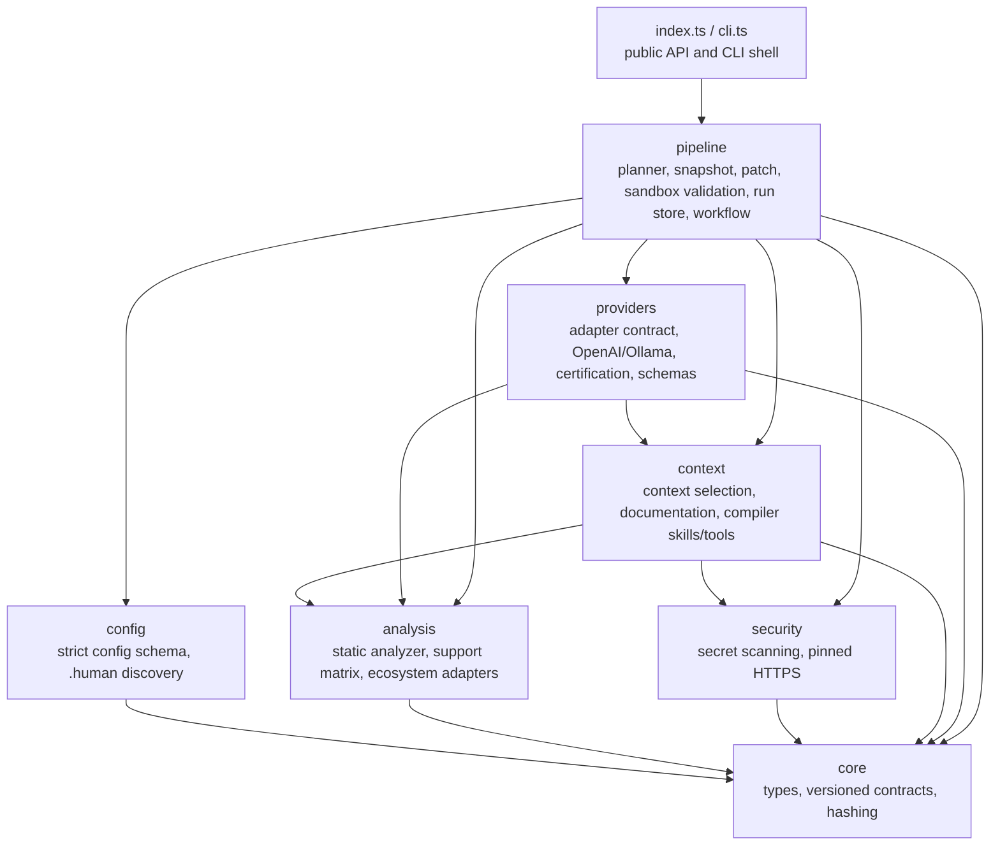

# Architecture

`human-to-code` turns a reviewed natural-language change request into a
validated, structured code patch. The design goal is not maximum capability —
it is that every step is **grounded, bounded, auditable, and fail-closed**.
This document describes how the code is layered, how a run flows through it,
and the dependency rules that keep the codebase scalable.

For per-file detail see [MODULES.md](MODULES.md); for the rules new code must
follow see [SCALABILITY.md](SCALABILITY.md); for the trust model see
[../SECURITY.md](../SECURITY.md).

## The pipeline

```text
static project analysis            (src/analysis)
        ↓
reviewed ChangeContractV1          (src/pipeline/planner.ts, src/core/contracts.ts)
        ↓
repository secret scan             (src/security/secret-scan.ts)
        ↓
grounded ContextManifestV1         (src/context)
        ↓
provider-generated PatchSetV1      (src/providers)
        ↓
baseline vs candidate in sandbox   (src/pipeline/validation.ts)
        ↓
explicit apply + exact rollback    (src/pipeline/patch.ts, workflow.ts)
```

Every arrow is a checkpoint: each stage validates its input artifact by exact
schema, records provenance hashes, and stops with a typed status
(`NEEDS_INPUT`, `UNSUPPORTED`, `INCONCLUSIVE`, `FAILED`, `SECURITY_BLOCKED`)
rather than guessing. Only `VERIFIED` is success for a generated run.

## Layers

Source is organized into domain folders that form a strict layering. A module
may import from its own layer or any layer **above** it in this diagram, never
below. `core` imports nothing; `cli` may import anything.



| Layer | Contents | Why it is separate |
| --- | --- | --- |
| `src/core/` | `types.ts`, `contracts.ts` | The versioned artifact vocabulary (`ChangeContractV1`, `PatchSetV1`, `ValidationPlanV1`, `RunRecordV1`, …), exact validators, canonical JSON, and SHA-256 helpers. Everything else speaks in these types, so they must depend on nothing. |
| `src/config/` | `config.ts`, `discovery.ts` | Operator policy input. Strict schema-versioned JSON (unknown keys rejected, credentials environment-only) and fail-closed discovery of `.human` sources. |
| `src/analysis/` | `analyzer.ts`, `analyzer-types.ts`, `analyzer-utils.ts`, `support-matrix.ts`, `adapters/` | Read-only static project intelligence. Adapters recognize ecosystems without executing project code; the support matrix declares — never infers — what is supported. |
| `src/security/` | `secret-scan.ts`, `pinned-http.ts` | Cross-cutting fail-closed guards: repository-wide credential scanning before any provider access, and a DNS-vetted address-pinned HTTPS client used for any outbound fetch. |
| `src/context/` | `context.ts`, `documentation.ts`, `compiler-skills.ts`, `compiler-tools.ts` | Everything the model is allowed to see: provenance-bound context selection, allowlisted exact-version documentation, immutable policy skills, and the bounded read-only context tool executor. |
| `src/providers/` | `provider.ts`, `providers.ts`, `certification.ts`, `schemas.ts` | Everything the model is allowed to do: the provider-neutral adapter contract, the bundled OpenAI/Ollama HTTP adapters, the JSON output schemas providers must satisfy, and the evidence-based certification gate that decides whether a provider/model result may ever become `VERIFIED`. |
| `src/pipeline/` | `planner.ts`, `snapshot.ts`, `patch.ts`, `validation.ts`, `run-store.ts`, `workflow.ts`, `file-memory.ts`, `simple.ts` | Run orchestration: contract drafting, immutable snapshots, patch safety and atomic apply/rollback, strong-sandbox baseline/candidate validation, the private run store, and the guided workflow that ties the stages together. `file-memory.ts` statically indexes declarations for the separate lightweight direct-generation path in `simple.ts`. `deep-agent.ts` is the default direct-flow engine: it builds and runs a LangChain/LangGraph deep agent (planning, filesystem, subagents, prompts) and is the only module permitted to import the `deepagents`/`langchain` runtime dependencies. |
| root | `index.ts`, `cli.ts` | Entry points only. `index.ts` re-exports the stable embedding API grouped by layer; `cli.ts` maps commands, flags, and exit codes onto that same surface. They stay at the source root so the published `dist/index.js` and `dist/cli.js` paths never move. |

Two intentional wrinkles in the layering:

- `context/context.ts` exports the `scanSecrets` primitive that `security/`,
  `providers/`, and `pipeline/` reuse at their trust boundaries. The pattern
  library lives once and is imported everywhere a value crosses a boundary.
- `providers/schemas.ts` lives with providers, not core, because its JSON
  schemas are the provider-facing wire format for `PatchSetV1`, distinct from
  the host-side validators in `core/contracts.ts`.

## Key design decisions

**Versioned artifacts, exact validation.** Every hand-off between stages is a
`*V1` JSON artifact validated with exact-object semantics — unknown fields are
errors. Changing an artifact's meaning requires a new schema version and an
explicit migration (see `migrate-config`), never silent reinterpretation.

**Provenance by hash.** Contracts bind to the SHA-256 of the `.human` source
and the project-profile fingerprint; patches carry exact base hashes; apply
and rollback verify hashes before touching a file. Staleness is detected, not
tolerated.

**Determinism where it belongs.** The LLM writes framework-specific patch
operations; everything around it — discovery, profiling, contract validation,
context selection, patch safety checks, validation-plan selection, apply — is
deterministic host code. The model never chooses its own scope, tools,
commands, credentials, or acceptance criteria.

**Fail-closed everywhere.** Ambiguous analysis returns `NEEDS_INPUT` or
`UNSUPPORTED`; a partial secret scan is a failure; a missing sandbox makes
validation `INCONCLUSIVE`; an empty certification registry means no run can be
`VERIFIED`. There are no bypass flags that turn a failed gate into success.

**Untrusted text stays data.** Source comments, READMEs, `.human` text,
diagnostics, dependency source, and fetched documentation are wrapped as
evidence and cannot change policy, commands, scope, tests, or budgets.

**Minimal-dependency host, agent engine aside.** The guided pipeline, the
`--simple` generator, and all host safety code (hashing, patch validation,
sandbox validation, HTTP adapters, secret scanning) use only Node built-ins —
their supply-chain surface is Node itself. The default `npx human-to-code .`
engine is the exception: it runs a LangChain/LangGraph deep agent and therefore
depends on `deepagents`, `langchain`, `@langchain/core`, `@langchain/openai`,
and `@langchain/ollama`. Choosing `--simple` keeps a run on the built-in-only
path. Do not add runtime dependencies to any layer other than the deep-agent
engine (`pipeline/deep-agent.ts`).

## The generation paths

1. **Deep-agent engine** (`pipeline/deep-agent.ts`, the default
   `npx human-to-code .` flow): a LangChain/LangGraph "deep agent"
   (`deepagents` harness) that decomposes the discovered worklist with the four
   deep-agent pillars — **Planning** (`write_todos`), **File System** (a
   real-disk `FilesystemBackend` rooted at the project), **Sub Agents** (a
   `planner`/`implementer`/`reviewer` reachable via the `task` tool), and
   **Prompts** (per-role system prompts). Here the model drives scope, file
   reads/writes, and delegation. The blast radius is bounded to the project root
   by the backend and by deny-write filesystem permissions on VCS, dependency,
   config, and secret paths — but this is an autonomous agent, not the
   hash-verified patch pipeline, and it never produces `VERIFIED` runs.
2. **Simple path** (`pipeline/simple.ts`, selected with `--simple`): a
   deliberately small, dependency-free receipt-and-confirm generator for whole
   `.human` files or inline `@human` markers against a local Ollama endpoint. It
   statically indexes declarations into ephemeral FileMemory and replaces marker
   ranges deterministically. It shares no state with the guided pipeline.
3. **Guided pipeline** (`workflow.ts`, the `guided` subcommand): full
   contract → grounding → sandbox validation lifecycle described above. This is
   the production-architecture path and the only one that can reach `VERIFIED`.

## Where things live at runtime

- **Working tree** — never mutated by `generate` or `validate`; only an
  explicit `apply` of a `VERIFIED` run writes to it, atomically per file.
- **Private run store** (`run-store.ts`, platform cache or
  `HUMAN_TO_CODE_CACHE/runs`) — run records, patches, reports, rollback
  artifacts. Every write is recursively secret-gated.
- **Snapshots** (`snapshot.ts`) — immutable baseline/candidate copies used
  for generation and sandbox validation, disposed after use.

## Testing shape

`test/` mirrors the source modules one-to-one (`analyzer.test.ts`,
`workflow.test.ts`, …) using `node:test` with injected fetch/DNS/clock/exec
seams — no real provider, network, or container daemon is required.
`test/package-smoke.mjs` packs the tarball, installs it into a clean temp
project, imports the public API, and invokes the installed CLI. See
[SCALABILITY.md](SCALABILITY.md) for the testing bar new code must meet.
