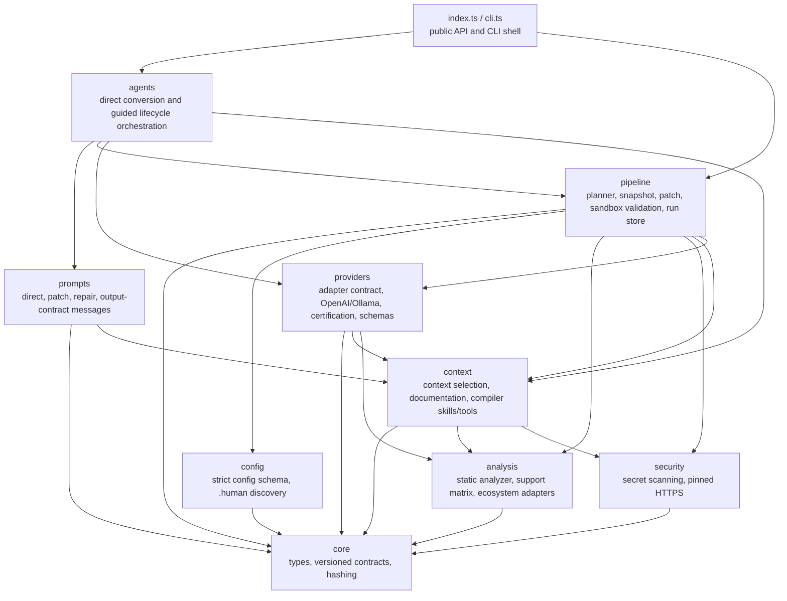

# Architecture

`human-to-code` takes a reviewed natural-language change request and turns it
into a validated, structured code patch. The goal here was never maximum
capability. It was that every single step is **grounded, bounded, auditable, and
fail-closed**. This document walks through how the code is layered, how a run
flows through it, and the dependency rules that keep all of it organized as it
grows.

Looking for something else? [GLOSSARY.md](GLOSSARY.md) has plain-English
terminology. [CODEBASE_TOUR.md](CODEBASE_TOUR.md) is the friendly
folder-by-folder walkthrough of how the product actually works.
[CODE_CLARITY.md](CODE_CLARITY.md) covers naming and lifecycle comments.
[MODULES.md](MODULES.md) goes file by file. [SCALABILITY.md](SCALABILITY.md) has
the rules new code needs to follow. [../SECURITY.md](../SECURITY.md) has the
trust model.

## The pipeline

```text
static project analysis            (src/analysis)
        ↓
reviewed ChangeContractV1          (src/pipeline/planner.ts, src/core/contracts.ts)
        ↓
repository secret scan             (src/security/secret-scan.ts)
        ↓
grounded ContextManifestV1         (src/context)
        ↓
provider-generated PatchSetV1      (src/providers)
        ↓
baseline vs candidate in sandbox   (src/pipeline/validation.ts)
        ↓
explicit apply + exact rollback    (src/pipeline/patch.ts, src/agents/guided/workflow.ts)
```

Every arrow is a checkpoint. Each stage validates the artifact it received
against an exact schema, records provenance hashes, and stops with a typed
status  -  `NEEDS_INPUT`, `UNSUPPORTED`, `INCONCLUSIVE`, `FAILED`,
`SECURITY_BLOCKED`  -  rather than guessing its way forward. For a generated run,
`VERIFIED` is the only thing that means success.

## Layers

Source lives in domain folders plus two explicit agent entry points. The
deterministic layers hold policy and mechanics, prompts only format the messages
the model sees, and agents coordinate those pieces. `core` imports nothing at
all, and `cli` is allowed to import anything.



| Layer | What's in it | Why it's on its own |
| --- | --- | --- |
| `src/core/` | `types.ts`, `contracts.ts` | The versioned artifact vocabulary (`ChangeContractV1`, `PatchSetV1`, `ValidationPlanV1`, `RunRecordV1`, ...), exact validators, canonical JSON, and SHA-256 helpers. Everything else talks in these types, which is exactly why they can't depend on anything. |
| `src/config/` | `config.ts`, `discovery.ts` | Operator policy coming in. Strict schema-versioned JSON  -  unknown keys rejected, credentials environment-only  -  plus fail-closed discovery of `.human` sources. |
| `src/analysis/` | `analyzer.ts`, `analyzer-types.ts`, `analyzer-utils.ts`, `support-matrix.ts`, `adapters/` | Read-only static project intelligence. Adapters recognize ecosystems without ever executing project code, and the support matrix declares what's supported  -  it never infers it. |
| `src/security/` | `secret-scan.ts`, `pinned-http.ts` | The cross-cutting fail-closed guards: repository-wide credential scanning before any provider access, and a DNS-vetted, address-pinned HTTPS client for every outbound fetch. |
| `src/context/` | `context.ts`, `documentation.ts`, `compiler-skills.ts`, `compiler-tools.ts` | Everything the model is allowed to *see*: provenance-bound context selection, allowlisted exact-version documentation, immutable policy skills, and the bounded read-only context tool executor. |
| `src/providers/` | `provider.ts`, `providers.ts`, `certification.ts`, `schemas.ts` | Everything the model is allowed to *do*: the provider-neutral adapter contract, the bundled OpenAI/Ollama HTTP adapters, the JSON output schemas providers have to satisfy, and the evidence-based certification gate that decides whether a provider/model result can ever become `VERIFIED`. |
| `src/prompts/` | `direct-conversion.ts`, `direct-integration.ts`, `direct-repair.ts`, `guided-patch.ts`, `guided-repair.ts`, `provider-output.ts` | Every model-facing message gets built here. Prompt builders take typed inputs and return strings or messages  -  no I/O, no provider calls, no host mutation. |
| `src/pipeline/` | `planner.ts`, `snapshot.ts`, `patch.ts`, `validation.ts`, `run-store.ts`, `file-memory.ts` | Deterministic execution mechanics: contract drafting, immutable snapshots, patch safety and atomic apply/rollback, strong-sandbox validation, private run storage, and static declaration indexing. `simple.ts` and `workflow.ts` are compatibility re-exports and nothing more. |
| `src/agents/` | `direct/`, `guided/` | The two services that actually use a model. `direct/` splits apart discovery, marker parsing, local FileMemory, project-level ProjectMemory, optional post-generation integration reconciliation, prompt invocation, presentation, and application. `guided/` owns reviewed-run policy and the auditable generate/validate/apply/rollback lifecycle. |
| root | `index.ts`, `cli.ts` | Entry points, nothing else. `index.ts` re-exports the stable embedding API grouped by layer; `cli.ts` maps commands, flags, and exit codes onto that same surface. They sit at the source root so the published `dist/index.js` and `dist/cli.js` paths never move. |

Two deliberate wrinkles in the layering, so they don't look like accidents:

- `context/context.ts` exports the `scanSecrets` primitive that `security/`,
  `providers/`, and `pipeline/` all reuse at their trust boundaries. The pattern
  library lives in exactly one place and gets imported everywhere a value
  crosses a boundary.
- `providers/schemas.ts` sits with providers rather than core, because its JSON
  schemas are the provider-facing *wire format* for `PatchSetV1`  -  a different
  thing from the host-side validators in `core/contracts.ts`.

## Key design decisions

**Versioned artifacts, exact validation.** Every hand-off between stages is a
`*V1` JSON artifact validated with exact-object semantics, so unknown fields are
errors. Changing what an artifact means requires a new schema version and an
explicit migration (see `migrate-config`)  -  never a silent reinterpretation.

**Provenance by hash.** Contracts bind to the SHA-256 of the `.human` source and
the project-profile fingerprint. Patches carry exact base hashes. Apply and
rollback verify hashes before touching a file. Staleness gets detected, not
tolerated.

**Determinism where it belongs.** The LLM writes framework-specific patch
operations. Everything around it  -  discovery, profiling, contract validation,
context selection, patch safety checks, validation-plan selection, apply  -  is
deterministic host code. The model never picks its own scope, tools, commands,
credentials, or acceptance criteria.

**Fail-closed everywhere.** Ambiguous analysis returns `NEEDS_INPUT` or
`UNSUPPORTED`. A partial secret scan is a failure. A missing sandbox makes
validation `INCONCLUSIVE`. An empty certification registry means no run can be
`VERIFIED`. There is no bypass flag anywhere that turns a failed gate into a
success.

**Untrusted text stays data.** Source comments, READMEs, `.human` text,
diagnostics, dependency source, and fetched documentation are all wrapped as
evidence. None of them can change policy, commands, scope, tests, or budgets.

**Prompts are explicit application artifacts.** Model-facing instructions live
in `src/prompts/` and nowhere else. Agent orchestration passes typed, validated
inputs into pure prompt builders. Provider transports don't invent agent policy,
and pipeline mechanics don't have prose instructions buried in them.

**Minimal-dependency host.** The guided pipeline and the host safety code  - 
hashing, patch validation, sandbox validation, HTTP adapters, secret scanning  - 
run on Node built-ins. The direct agent has two deliberate runtime dependencies:
the TypeScript compiler, which both rejects malformed JavaScript/TypeScript
candidates and type-checks TypeScript plus explicitly opted-in JavaScript before
any write, and `@types/node`, bundled so that `node:` builtin imports in
generated code resolve even in target projects that have no type dependencies of
their own. Other direct languages use host-owned structural checks. Adding
another runtime dependency still needs design review.

## The generation paths

1. **Direct agent** (`agents/direct/`, the default `npx human-to-code .` flow).
   Host code discovers the worklist and issues **plain model completions** with
   no tool calls, applying each result only after output normalization and
   candidate syntax validation.

   With `direct.planning` on (the default), a run opens with one shared
   *blueprint* request that fixes the file roster and the naming vocabulary
   every target has to use verbatim (`project-blueprint.ts`). That's the only
   moment where independently generated files can agree on anything. Each unit
   then gets a *todo* request, a coding request, and  -  only when a deterministic
   coverage check spots unaddressed items  -  one conditional completion request
   whose output is accepted solely if it preserved everything the previous pass
   produced (`unit-todos.ts`). Every planning pass is best-effort: an
   unparseable blueprint or todo list is thrown away and the unit falls back to
   the single-completion path, which is exactly what `planning.enabled: false`
   restores.

   It statically indexes declarations into ephemeral FileMemory so the model
   reuses symbols instead of re-declaring them. A separate ephemeral
   ProjectMemory models both the current repository and the projected tree
   you'd have after a successful run. For each target it renders a bounded
   conversion plan, exact relative companion paths, and compact language-aware
   contracts, and accepted candidates update those contracts for later requests.
   The memory is rebuilt from the deterministic discovery inventory every single
   run, so there's no persistent model cache waiting to go stale.

   Rollback-protected batch creation prevents sibling overwrite and partial
   whole-file runs, while exact marker-byte checks and shared indentation
   formatting keep inline application stale-safe. Every marker is isolated  -  a
   bad or failing unit gets retried, then skipped with a reason, and the rest
   still convert. Only a security stop aborts the whole run.

   Before anything is written, all accepted JavaScript/TypeScript units are
   staged into an in-memory candidate overlay (`candidate-overlay.ts`).
   TypeScript is type-checked with the TypeScript Compiler API; JavaScript
   semantic checking follows an explicit project `checkJs` or file `@ts-check`
   policy (`program-diagnostics.ts`) against the unchanged baseline, so
   pre-existing errors are never blamed on generated code. New cross-file
   diagnostics are attributed through the resolved import graph
   (`dependency-graph.ts`). A failing dependency-connected group gets at most
   one bounded repair completion per whole-file unit and is otherwise rejected
   whole (`staged-validation.ts`), while units proven independent still apply.

   Separately, `direct.crossFileChecks` cross-references generated HTML, CSS,
   and browser JavaScript against each other using the same static extractors
   ProjectMemory relies on, with **no model requests** at all
   (`reference-validation.ts`). A script selector or linked asset that doesn't
   exist is blocking; markup and stylesheet naming drift is advisory. That's
   reference checking, not verification.

   All of this is fast and works with small models that can't do tool-calling.
   When `direct.reconcileIntegrations` is on (the default), a separate generic
   audit/repair/verification stage consumes structured relationships from
   `language-relationships.ts`. Its orchestration has no web-only branch
   anywhere: ecosystem conventions for Python, Rust, Go, Java, C/C++, C#, Ruby,
   JavaScript/TypeScript, HTML/CSS/assets, and whatever comes next are isolated
   in extensible relationship and contract profiles.

   Combined static compilation is stronger than per-file syntax checks, but it
   is not a project build, a runtime test, sandbox execution, or API grounding.
   Other direct languages keep per-file structural validation. This path shares
   no state with the guided pipeline and never reaches `VERIFIED`.

2. **Guided agent** (`agents/guided/`, the `guided` subcommand). The full
   contract -> grounding -> sandbox validation lifecycle described above. This is
   the production-architecture path, and the only one that can reach `VERIFIED`.

## Where things live at runtime

- **Working tree**  -  never mutated by `generate` or `validate`. Only an explicit
  `apply` of a `VERIFIED` run writes to it, atomically per file.
- **Private run store** (`run-store.ts`, platform cache or
  `HUMAN_TO_CODE_CACHE/runs`)  -  run records, patches, reports, rollback
  artifacts. Every write is recursively secret-gated.
- **Snapshots** (`snapshot.ts`)  -  immutable baseline and candidate copies used
  for generation and sandbox validation, thrown away afterward.

## Testing shape

`test/` mirrors the source modules one-to-one (`analyzer.test.ts`,
`guided-agent.test.ts`, and so on) using `node:test` with injected
fetch/DNS/clock/exec seams. No real provider, network, or container daemon is
required to run it. `test/package-smoke.mjs` packs the tarball, installs it into
a clean temp project, imports the public API, and invokes the installed CLI.
[SCALABILITY.md](SCALABILITY.md) has the testing bar new code has to clear.
